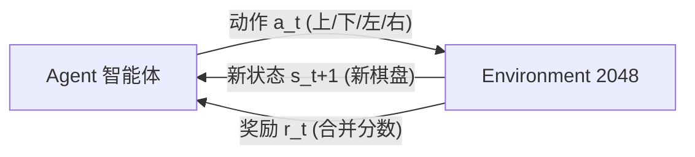
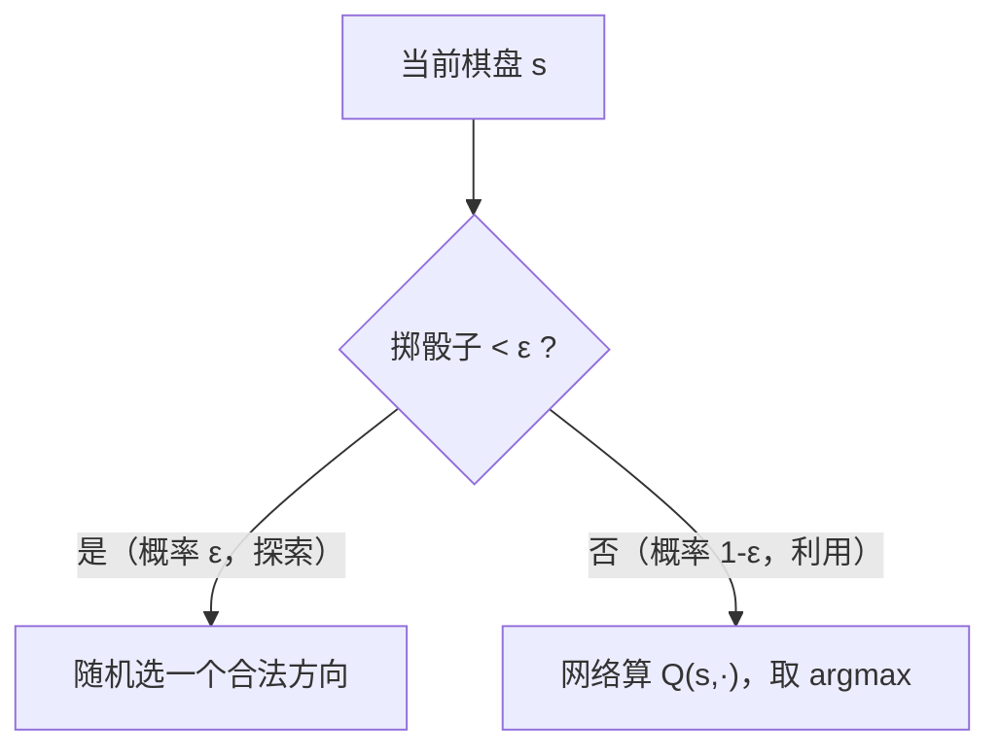

# DQN 技术报告 —— 以 2048 为例(写给刚学神经网络的人）

> 目标读者：**已经会一点神经网络（知道什么是层、激活、反向传播、损失函数），但对强化学习 / DQN 只有模糊印象**的人。
> 这份报告尽量从零把 DQN 讲清楚，并配上我们在这个 2048 项目里的**真实实验记录**（参数、怎么选、结果、踩的坑）。
> 这是一个**学习项目**，所以我会把"为什么"讲透，而不是只给结论。

---

## 阅读前的一句话结论（先有个全局观）

- **DQN**（Deep Q-Network）是"用神经网络来做 Q-learning"。它是**通用**的强化学习算法，但在 2048 这种游戏上**并不好训**，往往需要**很多很多步**（几十万～几百万步）才可能见效。
- 我们第一次跑 DQN 只跑了约 **15 万步就被中断了**，那次看不出明显学习效果 —— 但**这不能说明 DQN 不行，只能说明"没跑够 + 被打断"**。目前正在重新跑一次**训练足够久**的 DQN，跑够了再下结论（见 [第 7 章](#7-实验报告-dqn)）。
- 另有一种专门为 2048 这类棋盘游戏设计的方法 —— **n-tuple 网络 + afterstate TD 学习**，它样本效率高得多，我们这边**几分钟、几千局就能打到 2048**。它和 DQN 是**两套不同的思路**，第 8 章会专门讲。

换句话说：**"n-tuple TD 现在确实能打到 2048"是事实；"DQN 到底行不行"要等充分训练后才能定论。**

---

## 目录

1. [强化学习是什么：和"神经网络"有什么不一样](#1-强化学习是什么和神经网络有什么不一样)
2. [强化学习的数学骨架（MDP）](#2-强化学习的数学骨架mdp)
3. [价值函数与 Q 函数](#3-价值函数与-q-函数)
4. [Q-learning：不用神经网络也能学](#4-q-learning不用神经网络也能学)
5. [DQN = Q-learning + 神经网络 + 三个稳定技巧](#5-dqn--q-learning--神经网络--三个稳定技巧)
6. [Double DQN（我们用的版本）与本项目实现细节](#6-double-dqn与本项目实现细节)
7. [实验报告（DQN）](#7-实验报告-dqn)
8. [另一种方法：n-tuple 网络 + afterstate TD](#8-另一种方法n-tuple-网络--afterstate-td)
9. [经验总结：你应该记住的几点](#9-经验总结你应该记住的几点)
10. [附录：术语表 / 代码索引 / 延伸阅读](#10-附录)

---

## 1. 强化学习是什么：和"神经网络"有什么不一样

你学神经网络时接触的多半是**监督学习（supervised learning）**：

> 给一堆 `(输入 x, 正确答案 y)`，让网络学一个函数 `f(x) ≈ y`。比如给图片 + 标签"猫/狗"，网络学会分类。**关键是：每个输入都有一个现成的标准答案。**

**强化学习（Reinforcement Learning, RL）没有标准答案。** 它面对的是一个"要连续做决策、还要考虑长远后果"的问题。它的世界里有这些角色：

| 角色 | 英文 | 在 2048 里是什么 |
|---|---|---|
| 智能体 | agent | 我们要训练的 AI 玩家 |
| 环境 | environment | 2048 游戏本身（棋盘 + 规则 + 随机冒方块） |
| 状态 | state `s` | 当前 4×4 棋盘 |
| 动作 | action `a` | 上 / 下 / 左 / 右 |
| 奖励 | reward `r` | 这一步合并得到的分数 |

交互过程是一个循环：



Agent 在状态 `s` 下选一个动作 `a`，环境返回一个奖励 `r` 和新状态 `s'`，如此往复，直到游戏结束。**Agent 的目标不是"这一步得分最高"，而是"整局累计得分最高"。**

**这就是 RL 和监督学习的三个根本区别：**

1. **没有标准答案**：没人告诉你"这个棋盘应该往上走"。你只能自己试，从奖励里摸索。
2. **奖励是延迟的、稀疏的**：一步好棋的价值可能要等 20 步以后才体现出来（"因为我前面留了空格，现在才能合出大数"）。这叫**信用分配（credit assignment）问题** —— 到底是哪一步的功劳？
3. **数据是自己走出来的，而且会变**：你越走越强，看到的棋盘分布也在变。这叫**非平稳（non-stationary）**，训练起来比监督学习更难稳定。

> 🔑 **一句话**：监督学习是"照着答案学"，强化学习是"通过试错、根据奖励，学会一套长期最优的行为策略"。

---

## 2. 强化学习的数学骨架（MDP）

RL 问题通常写成一个 **MDP（马尔可夫决策过程）**。别被名字吓到，核心就几个量：

**回报（Return）—— 你真正想最大化的东西**

不是单步奖励 `r_t`，而是"从现在起，未来所有奖励的（打了折的）总和"：

```
G_t = r_t + γ·r_{t+1} + γ²·r_{t+2} + γ³·r_{t+3} + ...
```

- `γ`（gamma，**折扣因子**）是 0~1 之间的数。它表示"未来的奖励打几折"。
  - `γ=0`：只看眼前一步（短视）。
  - `γ→1`：非常看重长远。2048 一局有几百步，要看长远，所以我们取 **γ=0.99**（很接近 1）。
- 打折的两个原因：① 越远的未来越不确定；② 数学上保证这个无穷和收敛（不会变成无穷大）。

**策略（Policy）`π`**

策略就是"在状态 `s` 下怎么选动作"的规则，记作 `π(a|s)`。训练的终极目标是找到**最优策略 `π*`**，使得从任何状态出发的期望回报都最大。

---

## 3. 价值函数与 Q 函数

直接找"最优策略"很难。RL 的经典思路是：**先学会给"局面"或"局面+动作"打分，再据此选动作。**

- **状态价值 `V(s)`**：从状态 `s` 出发，按当前策略走下去，期望能拿到的总回报。—— "这个棋盘有多好"。
- **动作价值 `Q(s, a)`**：在状态 `s` 下**先走动作 `a`**，之后再按策略走，期望的总回报。—— "在这个棋盘上，往『上』走有多好"。

**为什么大家爱用 Q？** 因为一旦有了准确的 `Q(s,a)`，选动作就变得极其简单：

```
最优动作 a* = argmax_a Q(s, a)      # 哪个方向的 Q 最大就走哪个
```

不需要知道环境的规则、不需要模拟未来，只要对四个方向各算一个 Q 值，取最大即可。这就是 **Q-learning** 和 **DQN** 的立足点。

> 📌 记住这条主线：**学准 Q → 贪心地取 argmax → 就是好策略。** 后面所有内容都是围绕"怎么把 Q 学准"。

---

## 4. Q-learning：不用神经网络也能学

在用神经网络之前，先理解**表格版 Q-learning**（tabular Q-learning）——它是 DQN 的思想源头。

**Bellman 最优方程（直觉）**

"一个『局面+动作』的真实价值" = "这一步立刻拿到的奖励" + "打折后，走到下个局面时能拿到的最好价值"：

```
Q*(s, a)  =  r  +  γ · max_{a'} Q*(s', a')
             └─立即奖励─┘    └──下个状态里最好的那个动作的价值──┘
```

这是一个"自己定义自己"的递归式。如果我们的 Q 表满足这个等式，它就是最优的。

**TD 更新（边走边学，temporal-difference）**

我们不知道真实的 `Q*`，就用**估计值去逼近**。每走一步 `(s, a, r, s')`，就把 `Q(s,a)` 往"更靠谱的目标"挪一点点：

```
              ┌────────────── TD 目标（我们希望 Q 变成的值）──────────────┐
Q(s,a)  ←  Q(s,a)  +  α · [ ( r + γ · max_{a'} Q(s',a') )  −  Q(s,a) ]
                          └───────────────── TD 误差 δ ─────────────────┘
```

- `α`（学习率）：每次挪多少。
- 方括号里的 `δ` 叫 **TD 误差**：目标值和当前估计的差。**Q-learning 的本质就是想办法把 TD 误差降到 0。**

**为什么 2048 不能用表格？**

表格法要给"每一个可能的棋盘 × 每个动作"存一个数。2048 的棋盘（16 个格子，每格可能是 0,2,4,…,几千）状态数是**天文数字**，根本存不下，而且绝大多数局面你一辈子只会遇到一次（表格学不到任何泛化）。

**解决办法：用一个函数来"压缩"这张表 —— 这个函数就是神经网络。这就是 DQN。**

---

## 5. DQN = Q-learning + 神经网络 + 三个稳定技巧

**核心思想**：用一个带参数 `θ` 的神经网络 `Q(s, a; θ)` 来近似那张巨大的 Q 表。输入一个棋盘 `s`，输出 4 个数（四个方向的 Q 值）。

**训练目标（损失函数）**：就是让网络的输出去满足 Bellman 方程，也就是**最小化 TD 误差**：

```
Loss(θ) = [ ( r + γ · max_{a'} Q(s', a'; θ⁻) )  −  Q(s, a; θ) ]²
            └──────────── 目标 y（不回传梯度）────────────┘
```

这看起来就像监督学习的"预测 vs 目标"的均方误差 —— 区别是**这里的"目标 y"是网络自己算出来的**（还在不断变化）。这带来两个麻烦，DQN 用两个技巧解决，加上一个探索技巧，一共三招：

### 技巧 1：经验回放（Experience Replay）

**问题**：如果按游戏顺序，用刚走的这一步立刻训练，连续的样本高度相关（前后棋盘几乎一样），神经网络在相关数据上训练会不稳、容易遗忘。

**做法**：把每一步的经验 `(s, a, r, s', done)` 存进一个大池子（**replay buffer**，我们设 10 万条）。训练时从池子里**随机抽一批（batch）**来更新。

- 好处①：打乱相关性，训练更稳。
- 好处②：一条经验可以被反复采样、多次利用，样本效率更高。

对应代码：`DQNPlayer.remember()` 存经验、`DQNPlayer.replay()` 随机抽 batch 训练（`src/agent/agentImpl.py`）。

### 技巧 2：目标网络（Target Network）

**问题**：损失里的"目标 y"用的是网络自己 `Q(s',a';θ)`。如果目标随着网络每一步都在变，就像"追一个自己在动的靶子"，训练会震荡甚至发散。

**做法**：复制一份网络叫**目标网络 `θ⁻`**，专门用来算目标 y，并且**冻结它、只每隔 N 步才把主网络的参数同步过去一次**（我们设每 1000 步同步一次）。这样靶子在一段时间内是稳定的。

对应代码：`self.policy_net`（主网络）和 `self.target_net`（目标网络），`update_target_network()` 负责同步。

### 技巧 3：ε-greedy 探索（Exploration vs Exploitation）

**问题**：如果一直贪心地按当前 Q 选最优动作，可能永远发现不了"其实还有更好的走法"（陷入局部）。必须时不时随机尝试。

**做法**：以概率 `ε` **随机**选动作（探索），以概率 `1-ε` 按 `argmax Q` 选（利用）。训练初期 `ε=1.0`（全靠试），随训练**线性衰减**到一个很小的值（我们到 `0.05`）。



### 完整训练循环（伪代码）

```
初始化主网络 θ、目标网络 θ⁻ ← θ、空的 replay buffer
for 每一局 (episode):
    重开一局，得到初始棋盘 s
    while 游戏没结束:
        用 ε-greedy 选动作 a
        执行 a，得到奖励 r、新棋盘 s'、是否结束 done
        把 (s, a, r, s', done) 存进 buffer
        从 buffer 随机抽一个 batch:
            对每条: 目标 y = r + (1-done)·γ·max_{a'} Q(s',a'; θ⁻)
            用 (y − Q(s,a; θ))² 做一次梯度下降，更新 θ
        每隔 1000 步:  θ⁻ ← θ        # 同步目标网络
        衰减 ε
        s ← s'
```

---

## 6. Double DQN与本项目实现细节

### 6.1 Double DQN：修正"过高估计"

普通 DQN 的目标里有个 `max_{a'} Q(s',a'; θ⁻)`。这个 `max` 有个已知毛病：**系统性地高估** Q 值（因为它总是挑最大的那个，而估计里的噪声正好被 max 放大）。高估会让训练变差。

**Double DQN** 的修法很巧妙：**把"选哪个动作"和"给它打分"这两件事拆给两个网络**：

```
普通 DQN:   y = r + γ · Q(s', argmax_{a'} Q(s',a'; θ⁻); θ⁻)     # 选和评都用目标网络
Double DQN: y = r + γ · Q(s', argmax_{a'} Q(s',a'; θ ); θ⁻)     # 用主网络选、用目标网络评
                              └─ 主网络选动作 ─┘  └─目标网络打分─┘
```

我们用的就是 Double DQN（`DQNPlayer.replay()`）。

### 6.2 本项目的几个关键设计（都在 `src/agent/`）

**① 状态表示：16 通道 one-hot（`src/agent/model/dqn.py`）**

棋盘上的数字是 2 的幂（2,4,8,…）。有两种喂给网络的方式：
- ❌ 单通道，直接把 `log2(数字)` 当一个数 → 网络要自己从一个标量里学出"2 和 1024 是完全不同的东西"，很难。
- ✅ **16 通道 one-hot**：把每个格子的指数（0 表示空，1 表示 2，2 表示 4，…）展开成 16 个通道，"这个格子是不是 128"就是一个独立的 0/1 特征。

这一步是让 CNN 能学起来的**关键**。之后接两层 `Conv2d(kernel=2)` + 两层全连接 → 输出 4 个 Q 值。**没有用 BatchNorm/Dropout**，这样"单个棋盘推理"和"一批棋盘训练"行为完全一致（省掉一类常见 bug）。

**② 动作屏蔽 Action masking（`valid_moves_mask()`）**

2048 里有些方向按下去棋盘根本不动（无效动作）。我们**只在"会改变棋盘的合法动作"里选**。好处：游戏永远在推进（不会因为反复选无效动作而卡死），也不需要给无效动作设计惩罚。

**③ 奖励设计（`calculate_reward()`）**

```
reward = 本步合并得分 × 0.01  +  (如果刷新了最大方块) log2(新的最大方块)
```

- 乘 `0.01` 是把游戏原始分数（可能几百）**缩小到 O(1) 量级**，避免 Q 值过大导致训练不稳。
- 刷新最大方块给一点额外奖励，鼓励"往更大的数进发"。

**④ CPU / GPU 分工（很重要的工程点）**

游戏模拟（棋盘滑动合并）用 **CPU 上的 numpy + numba**（`NumpyStaticBoard`）跑；**只有神经网络放在 MPS（苹果 GPU）上**。原因：棋盘是 4×4 的小张量，若放到 GPU 上做逐格标量运算，会疯狂地在 CPU↔GPU 之间搬数据，反而极慢。**小而碎的运算留 CPU，大矩阵运算交 GPU** —— 这是用 GPU 加速时的常识但很容易踩坑。

---

## 7. 实验报告（DQN）

### 7.1 名词澄清：episode / step /（没有 epoch）

你提到"epoch"——在**在线强化学习里其实没有 epoch 的概念**，容易混淆，这里澄清一下：

| 名词 | 含义 | 在我们这里 |
|---|---|---|
| **step（步）** | 走一步棋 = 一次"选动作→环境反馈→存经验→训练一次" | 训练规模主要按 step 算 |
| **episode（局）** | 一整局游戏，从开局到结束，通常几十~几百步 | 我们按 episode 计数、每局记录一次指标 |
| **epoch（轮）** | 监督学习里"把整个固定数据集过一遍"。RL 数据是边跑边生成、无限的，**没有固定数据集，所以没有 epoch** | 不适用 |

所以下面看到的是"多少 episode / 多少 step"，不是 epoch。

### 7.2 超参数表（以及**每个是怎么选的**）

| 超参数 | 值 | 作用 | 怎么选的 / 为什么 |
|---|---|---|---|
| episodes（局数上限） | 15000 | 训练多少局 | 第一次只有 1300 局远远不够；这次给足，按学习曲线决定何时停 |
| batch_size | 256 | 每次梯度更新用多少条经验 | 大 batch 梯度更稳，256 是常见稳妥值 |
| memory_size | 100000 | replay buffer 容量 | 存最近 10 万条转移，兼顾多样性与内存 |
| γ (gamma) | 0.99 | 未来奖励折扣 | 一局几百步，要看长远，取接近 1 |
| learning_rate | 5e-4 | Adam 学习率 | 常见范围 1e-4~1e-3，偏小更稳 |
| ε 起点 → ε_min | 1.0 → 0.05 | 探索率 | 从全随机逐步过渡到几乎全贪心，保留 5% 随机避免僵死 |
| epsilon_decay_steps | 250000 | ε 线性衰减到底需要的步数 | **第一次用 10 万步太快**，网络还没学好就停止探索了；这次拉长到 25 万步 |
| target_update | 1000 步 | 目标网络多久同步一次 | 太频繁→不稳，太慢→滞后；1000 步是常见折中 |
| train_every | 1 | 每走几步训练一次 | 每步都训练，样本利用最充分 |
| reward_scale | 0.01 | 分数缩放系数 | 让每步奖励在 O(1)，Q 值不至于爆炸 |
| 优化器 / 损失 | Adam / Huber(SmoothL1) | —— | Huber 对离群 TD 误差更鲁棒；梯度裁剪到范数 1.0 防爆炸 |
| device | MPS（苹果 GPU） | 网络计算 | 自动选 MPS/CUDA/CPU |

### 7.3 第一次运行的结果（**被中断、步数不足**，仅供参考）

命令：`train_dqn.py --episodes 3000 --epsilon-decay-steps 100000 ...`
实际只跑到 **~1300 局 / ~15 万步 / ~25 分钟就被意外暂停**。用**贪心策略**（关掉探索）评估的曲线：

| 评估点 | mean 最大方块 | best 方块 | mean 分数 | 到 2048 |
|---|---|---|---|---|
| ep100 | 103 | 256 | 1105 | 0% |
| ep300 | 107 | 256 | 1142 | 0% |
| ep500 | 86 | 256 | 927 | 0% |
| ep900 | 81 | 256 | 830 | 0% |
| ep1300 | 95 | 256 | 989 | 0% |

**对照基线**：一个**完全没训练**、只做动作屏蔽的贪心策略，mean 最大方块也在 ~85、best 256 左右。

**怎么读这张表**：15 万步内，贪心评估的水平≈随机基线，最大方块卡在 256，没看到明显上升趋势。

> ⚠️ **重要提醒（对上一版结论的纠正）**：**不能据此说"DQN 不行"。** 15 万步对 2048 的 DQN 属于**很短**（这类任务常需几十万到几百万步），而且这次还被中途暂停。合理的结论只是"**这次没跑够、被打断，暂时看不出学习效果**"。

### 7.4 公平复现：普通 DQN 跑够步数，仍然学不动

为了不重蹈"没跑够就下结论"的覆辙，我们重跑了一次：`epsilon_decay_steps=250000`、每 200 局评估、每 500 局存档、支持 `--resume` 断点续训。结果（贪心评估的 mean 最大方块）：

```
ep200 ep600 ep1000 ep1400 ep1800 ep2200 ep2600
 111    90     91     85     78     88     75      ← ε 在 ~ep2200 已归零，之后还是平的
```

跑到 **~29 万步、ε 已衰减到底（全靠网络贪心）**，评估**始终贴着随机基线，最大方块从未越过 256，到 2048 = 0%**。

> ✅ **这才是可以下的结论**：不是"没跑够"（ε 都归零了），而是**这套 vanilla Double-DQN 在 2048 上确实学不起来**。最可能的原因就是 [8.1 节](#81-先理解-dqn-在-2048-上难的地方)讲的 `Q(s,a)≈V(s)`：网络四个方向的输出趋同，贪心 argmax≈随机。

### 7.4b Dueling DQN + 奖励塑形：仍然平 —— 但暴露了真正的病根

针对 `Q≈V` 的猜测，先做了两处改动：

1. **Dueling 架构**（`src/agent/model/dqn.py`）：输出头拆成 `V(s)` 和各动作优势 `A(s,a)`，`Q = V + [A − mean A]`，让网络能显式表达"四个方向差不多、但这个略优"。
2. **空格势能塑形**（`src/agent/agentImpl.py`）：`F = γ·φ(s') − φ(s)`，`φ = 0.5×空格数`，理论上不改变最优策略，只给更密的引导。

结果：训练满 15000 局（**~4.6 小时、~150 万步**），**评估依然全程贴基线**（mean 最大方块 ~95、最大方块卡在 256、2048 = 0%）。Dueling 没救活它。

**于是做诊断** —— 把训练好的网络拿出来，喂几个棋盘看它输出的 Q 值：

```
|Q| 幅度 ≈ 140,000    ← 正常应该是几十~几百！
```

**Q 值爆炸到了 ~10⁵。** 这是经典的 **价值发散（value divergence，"deadly triad"：自举 + 函数逼近 + off-policy）**：目标 `target = r + γ·Q(s')` 里用的是网络自己（被高估）的 Q，正反馈滚雪球，150 万步下来 Q 冲到十万量级，整个值函数变成垃圾数值 → 策略当然烂。Dueling 改的是网络的头，救不了整体发散。

> 🐞 **一个诊断插曲（也是教训）**：我第一版探针用了固定种子 `Game(seed=7)`，而 `restart()` 每次都重置到同一种子，导致 100 个"测试棋盘"其实**全都一样**，假出一个"网络输出常数、忽略输入"的错误结论。换成真正不同的棋盘重测才发现：网络其实**是看棋盘的**，只是 Q 数值发散了。**教训：诊断代码本身也会有 bug —— 查模型前先确认你的探针喂进去的是真正不一样的输入。**

**根因**：漏了 DQN 的一个标准稳定器 —— **奖励有界化（reward clipping）**。`log2(新最大方块)` 奖励最高到 +11、分数项也没封顶，配 γ=0.99 的自举放大，就发散了。

### 7.4c 修复 reward clipping：发散治好了，但策略仍难突破

**修复**（`src/agent/agentImpl.py`，新增 `--reward-clip`）：把每步奖励裁剪到 `[−1, 1]`，这样 Q 数学上被限制在 ~`[−100, 100]`，不会爆炸。

验证（5000 局 / 68 分）：

- ✅ **发散治好了**：Q 幅度从 ~140,000 降到 **~7**；网络看棋盘、动作间差异从占比 0.18% 回到 ~10%，回到健康可学区间。
- ❌ **但策略仍然基本没学起来**：评估全程 mean 最大方块 ~95（基线 ~85）、最大方块基本还是 256（5000 局里只有最后一次评估的 30 局中偶然出现 1 次 512）、2048 = 0%，曲线没有上升趋势。

### 7.4d 对普通 DQN 的最终结论

给足了公平机会（多种架构、~150 万步、并修掉了发散 bug）之后：

> **即使训练稳定，vanilla value-based DQN 在 2048 上依然只能勉强超过随机基线，冲不过 256~512、到不了 2048。** 修 bug 让它从"发散崩溃"回到"健康但学不太动"，但没能让它变强。

真正卡住它的，是 2048 对 Q-learning 特别不友好的两点：

1. **探索 / 覆盖问题**：ε-greedy 从零开始，随机走很快就死，**几乎到不了高分方块的局面**，replay 池里全是早期低级局面 → 网络永远学不到高级局面该怎么走。
2. **信用分配 + 动作价值细微**：一步好棋的价值要几十步后才体现，而四个方向的价值差异本就细微、回报方差又大。

这两点正是 **afterstate 方法（n-tuple TD）天生规避的** —— 它用 `r(s,a) + V(afterstate)` 选动作，奖励项让动作从一开始就区分得很清楚，样本效率高出几个数量级（第 8 章：80.6% 到 2048）。

> 💡 **想让 DQN 在 2048 上更强**，通常还得叠加：n-step 回报（改善信用分配）、prioritized replay（优先学稀有的高级局面）、更好的探索，甚至干脆改成 afterstate 值网络。这些超出"入门 DQN"的范围，但方向是清楚的。

### 7.5 我们是怎么"评估"的（避免自欺）

训练时 ε 有随机性，看训练时的分数会高估或低估真实水平。所以我们单独用 **greedy 评估**：关掉探索（ε=0）、只用网络贪心选动作，跑几十局，统计"平均分 / 平均最大方块 / 最大方块分布 / 到 1024、2048 的比例"，并和**未训练基线**对比。代码：`DQNPlayer.evaluate()` 与独立脚本 `evaluate_model.py`。

---

## 8. 另一种方法：n-tuple 网络 + afterstate TD

你说没学过 n-tuple，这里从头讲。它**不是 DQN**，是另一套价值学习方法，也是 2048 这类游戏的"标准强解"（Szubert & Jaśkowski, 2014）。它在我们这边 **几分钟、几千局就能打到 2048**。

### 8.1 先理解 DQN 在 2048 上"难"的地方

DQN 学的是 `Q(s, a)`。但在 2048 里，"这个棋盘往上还是往下"造成的价值差别，**相比整个棋盘本身的价值来说非常小**。于是网络容易学成 `Q(s, 上) ≈ Q(s, 下) ≈ … ≈ V(s)`（四个方向差不多），贪心 `argmax` 就近乎**随机** —— 这正是我们第一次实验看到的"贴着基线"。这不是绝对学不了（训练够久、加 dueling 等技巧仍可能改善），但确实很吃力。

### 8.2 afterstate：把"你的操作"和"环境的随机"分开

2048 每走一步其实分两个阶段：

```
状态 s ──(你选方向,滑动+合并,确定性)──▶ afterstate s'  ──(环境随机冒一个2或4)──▶ 下一状态 s''
        └────────── 你能控制的部分 ─────────┘        └──── 环境的随机部分 ────┘
```

`afterstate`（**后状态**）= 你的动作造成的那个**确定的中间棋盘**（还没冒新方块）。关键点子：**与其学 `Q(s,a)`，不如学 `V(afterstate)`**，然后这样选动作：

```
a* = argmax_a [ 本步合并得分 r(s,a)  +  V(afterstate(s,a)) ]
                └── 立刻能算出的、区分度很强 ──┘
```

那个"本步合并得分 `r`"直接把不同方向拉开了差距，不用像 DQN 那样指望网络自己学出细微差别 —— **这就是它比 DQN 干净、好学的根本原因**。而且我们的引擎里 `NumpyStaticBoard.move(棋盘, 方向, inplace=False)` 返回的正好就是 `(afterstate, 合并得分, 是否改变)`，天然契合。

### 8.3 n-tuple 网络：`V` 不是神经网络，是"查表求和"

`V(棋盘)` 怎么算？不用神经网络，用**若干张查找表（look-up table）**：

- 选定几组固定的格子（每组叫一个 **tuple / pattern**）。我们用 4 个 **6 格** pattern（覆盖行、矩形块）。
- 对某个 pattern，把它覆盖的 6 个格子的数值组合当成一个"索引"，去它自己的表里查一个权重。
- **所有 pattern 查到的权重相加，就是 `V(棋盘)`**。

```
V(棋盘) = 表₁[看格子{0,1,2,3,4,5}] + 表₂[看格子{4,5,6,7,8,9}] + 表₃[...] + 表₄[...]
```

**对称性权重共享（关键加速）**：2048 棋盘旋转/翻转后价值不变，所以每个 pattern 在 **8 种对称**（4 旋转 × 2 翻转）下**共用同一张表**。效果是"走一步棋 = 从 8 个角度各学了一遍"，样本效率暴涨。代码：`src/agent/ntuple.py` 的 `NTupleNetwork`。

### 8.4 学习规则（afterstate 版 TD）

和 Q-learning 一样是 TD，只不过学的是 afterstate 的价值：走到 afterstate `s'` 后，让 `V(s')` 朝"下一步的合并得分 + 下一个 afterstate 的价值"靠近：

```
V(s')  ←  V(s')  +  α · [ ( r_next + V(s'_next) )  −  V(s') ]
```

因为是**线性模型 + 查表**，每个权重直接对应一个具体的局部棋型，学得又快又稳。

### 8.5 结果对比（真实数据）

| 方法 | 训练量 | mean 最大方块（贪心） | best 方块 | mean 分数 | 到 2048 比例 |
|---|---|---|---|---|---|
| 未训练基线（带屏蔽的贪心） | 0 | ~85 | 256 | ~900 | 0% |
| **DQN（普通 Double）** 公平复现 | 29 万步（ε 归零） | ~85 | 256 | ~870 | 0% |
| **DQN（Dueling+塑形）** | 150 万步 / 4.6h（Q 发散到 10⁵） | ~95 | 256 | ~1050 | 0% |
| **DQN（+ reward clip 修复发散）** | 60 万步 / 68min | ~95 | 512\* | ~950 | 0% |
| **n-tuple TD** | 4000 局 / ~3 分 | 1024 | 2048 | 15451 | 12% |
| **n-tuple TD** | 40000 局 / 96 分 | **2587** | **8192** | **43973** | **80.6%** |

\* 512 只在最后一次评估的 30 局里偶然出现 1 次，基本仍卡在 256。

**读表要点**：三次 DQN（普通 / Dueling / 修复发散后）**全部到不了 2048**，最好也就偶尔摸到 512；而 n-tuple 训练满后 **80.6% 到 2048、97.2% 到 1024、约 36% 到 4096、还偶尔打到 8192**。作为参照，本仓库最强的传统搜索智能体 `BacktrackingAIPlayer`（深度 5）到 2048 约 32% 且每步 ~19 秒；n-tuple 出手**瞬时**。

> **对普通 DQN 的完整结论**（详见 [7.4b–7.4d](#74b-dueling-dqn--奖励塑形仍然平--但暴露了真正的病根)）：给足公平机会后（多架构、~150 万步、并修掉了 Q 发散 bug），vanilla value-based DQN 在 2048 上**依然只能勉强超过随机基线**。修 bug 让它从"发散崩溃"回到"健康但学不太动"，但没让它变强。根本瓶颈是 2048 对 Q-learning 的探索/信用分配特别不友好 —— 而这正是 afterstate 方法（n-tuple）天生规避的。

---

## 9. 经验总结：你应该记住的几点

1. **DQN 的主线**：学准 `Q(s,a)` → 贪心 `argmax` 就是好策略。三大技巧（经验回放、目标网络、ε-greedy）全是为了**把这件事训得稳**。
2. **RL 很吃"步数"**：DQN 常常要几十万~几百万步才见效。**没跑够就说"不行"是常见误判**（我第一次就犯了，已纠正）。评估要用**关掉探索的 greedy**，并和**基线**比。
3. **状态表示很关键**：2048 用 16 通道 one-hot 远好于单通道 log2。喂给网络的"特征"往往比网络结构更重要。
4. **工程细节能决定成败**：小而碎的运算放 CPU、大矩阵放 GPU；动作屏蔽避免卡死；奖励缩放到 O(1) 防止 Q 值爆炸。
5. **没有"万能算法"**：DQN 通用但在 2048 上吃力（`Q(s,a)≈V(s)`）；n-tuple + afterstate TD 是为这类棋盘"量身定做"的，样本效率高得多。**选对问题的建模方式，常比调参更重要。**

---

## 10. 附录

### 术语速查

| 术语 | 一句话解释 |
|---|---|
| state / action / reward | 状态 / 动作 / 奖励 |
| return `G` | 未来奖励的折扣总和（真正要最大化的量） |
| γ discount | 折扣因子，未来奖励打几折 |
| policy `π` | 策略：状态→动作的选法 |
| `V(s)` / `Q(s,a)` | 状态价值 / 动作价值 |
| TD error | 目标值与当前估计之差，学习就是把它压到 0 |
| experience replay | 经验回放：存经验、随机抽 batch 训练 |
| target network | 目标网络：算目标用的冻结副本，隔段时间同步 |
| ε-greedy | 以 ε 概率随机、否则贪心，用于探索 |
| Double DQN | 用主网络选动作、目标网络打分，缓解过高估计 |
| episode / step | 一局 / 一步（RL 里没有 epoch） |
| afterstate | 动作造成的确定中间棋盘（随机冒方块之前） |
| n-tuple network | 用若干"看局部格子的查找表"求和来近似价值函数 |

### 代码索引

| 文件 | 内容 |
|---|---|
| `src/agent/model/dqn.py` | DQN 网络（16 通道 one-hot + CNN） |
| `src/agent/agentImpl.py` → `DQNPlayer` | Double DQN 智能体：经验回放、目标网络、ε-greedy、动作屏蔽、评估 |
| `train_dqn.py` | DQN 无界面训练脚本（含 `--smoke`、`--resume`） |
| `evaluate_model.py` | 加载 DQN 存档、greedy 评估 + 与基线对比 |
| `src/agent/ntuple.py` | n-tuple 网络 + afterstate TD 智能体 |
| `train_ntuple.py` | n-tuple 训练脚本 |

### 怎么复现 / 看训练曲线

```bash
uv run train_dqn.py --smoke            # 先跑通流程（5 局）
uv run train_dqn.py --episodes 15000 --epsilon-decay-steps 250000 --eval-every 200
uv run train_ntuple.py                 # 对照：n-tuple，几分钟见效
tensorboard --logdir runs              # 浏览器看 Score / MaxTile / Eval 曲线
```

### 延伸阅读

- Mnih et al., 2015, *Human-level control through deep reinforcement learning*（DQN 原始论文，Atari）
- van Hasselt et al., 2016, *Deep Reinforcement Learning with Double Q-learning*（Double DQN）
- Sutton & Barto, *Reinforcement Learning: An Introduction*（RL 圣经，前几章足够打基础）
- Szubert & Jaśkowski, 2014, *Temporal Difference Learning of N-Tuple Networks for the Game 2048*（n-tuple + afterstate）

---

> **最终状态（DQN 调查完结）**：n-tuple 训练完成 —— **80.6% 到 2048、最高 8192**。DQN 三次尝试（普通 / Dueling / 修复 Q 发散后）全部到不了 2048、最好只偶尔摸到 512；诊断出的核心 bug 是**价值发散**（Q→10⁵，已用 reward clipping 修复），但修好后仍受限于 2048 对 Q-learning 的探索/信用分配难题。完整故事见 [7.4b–7.4d](#74b-dueling-dqn--奖励塑形仍然平--但暴露了真正的病根)。
